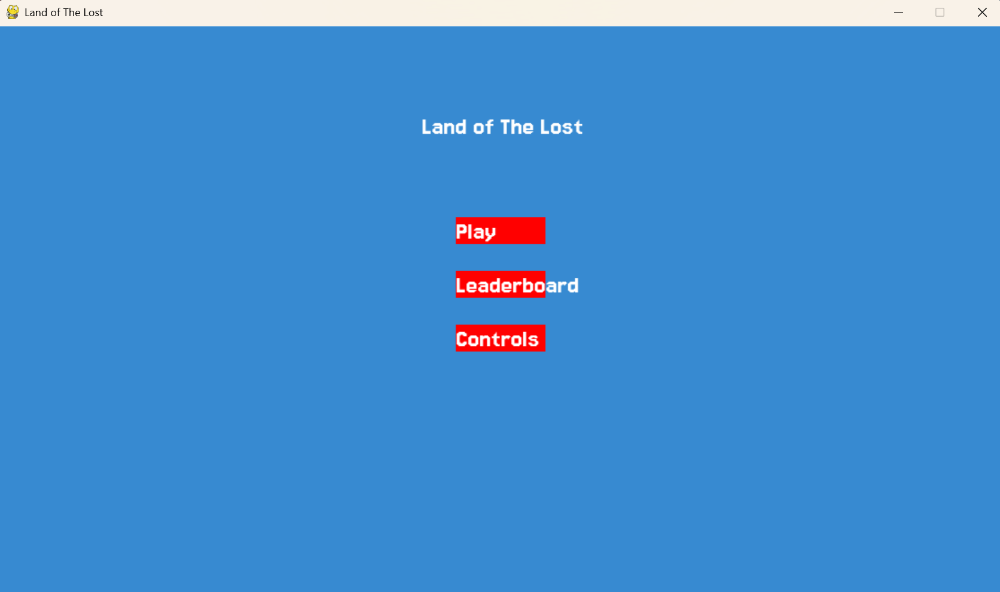
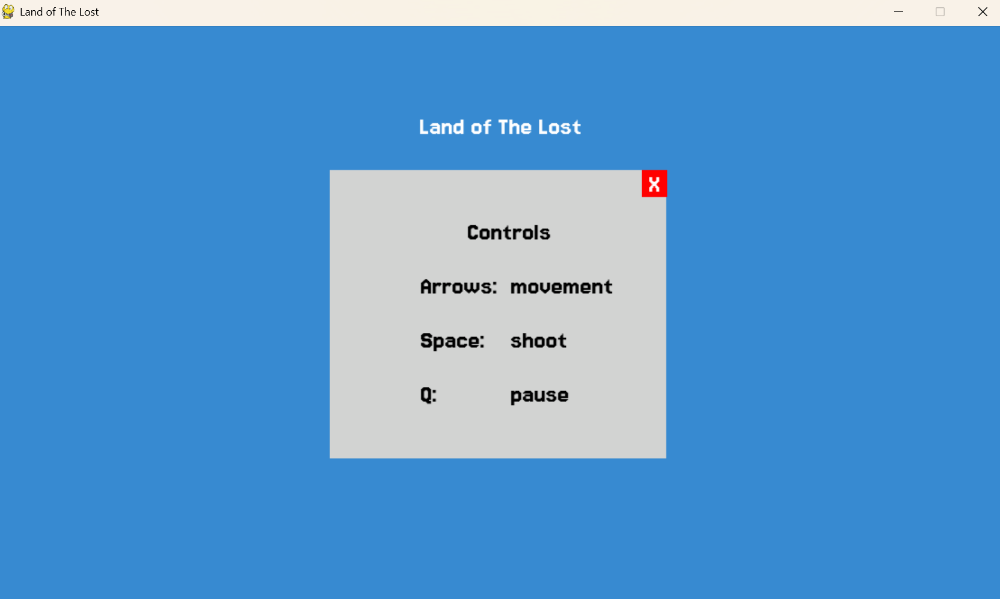
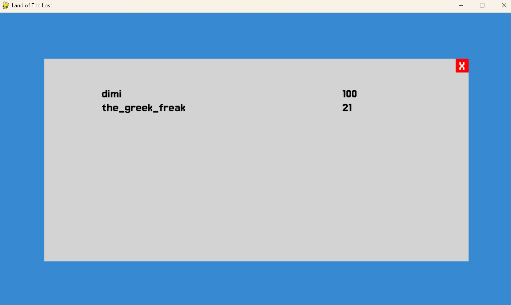
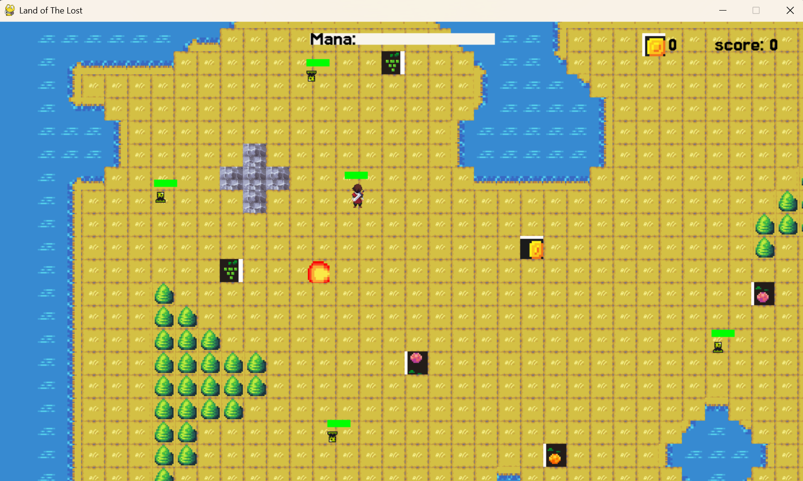

# Land of The Lost
A retro style 2D rpg game with combat, collectables, score, and intelligent bosses through the **A Star** algorithm.

## App Functionality

**Main Menu:** Upon loading the game, users are taken to the main menu where they can play the game, view the leaderboard, or learn the controls.

**Controls:** Users are able to view the game controls

**Leaderboard:** People can see the top scores for the game. This is still being developed to show actual scores, as it currently only shows dummy values.

## Gameplay

Players move around a large map and kill enemies, collect coins, and eat fruit to regenerate their health. Killing enemies increases your mana, which lets you cast more fireballs.

The boss uses A* to track the player and chase them across the map.

